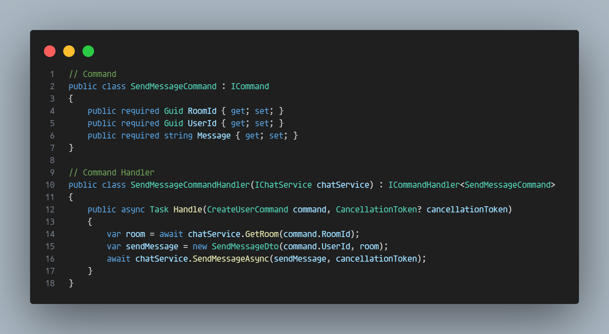

# CQRS-NET
### Implementation of Command Query Responsibility Segregation Pattern in C#.

#### Create Commands, Queries and Handlers.

 

#### Manual CQRS service configuration.

 

#### Dependency Injection.

Configure CQRS service:

 

CQRS service injection in controller method:

 

Handlers can be injected directly:

 